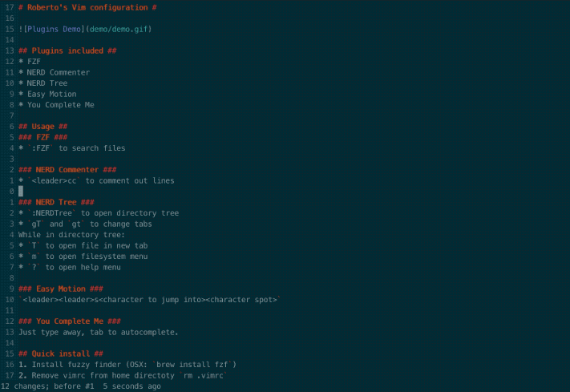
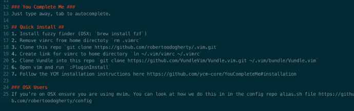
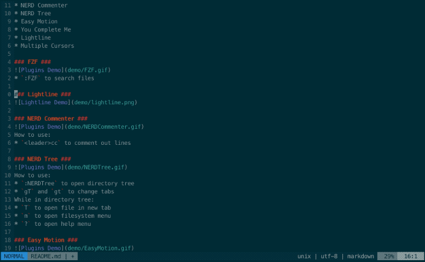
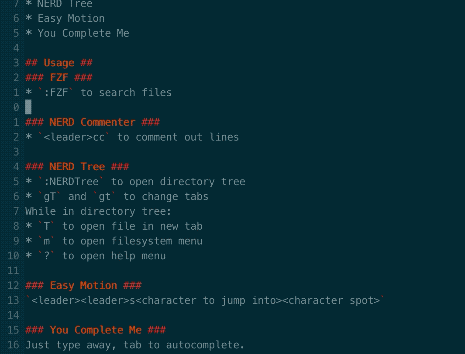
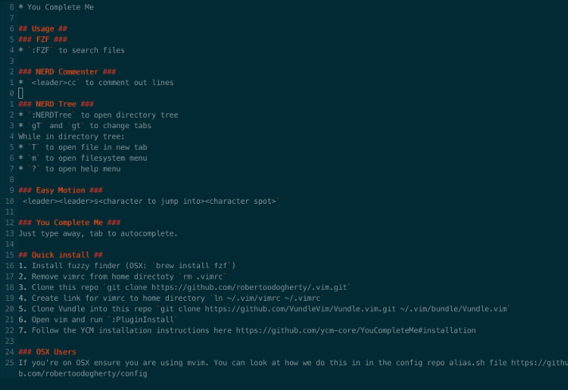
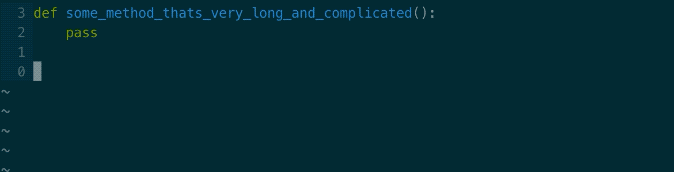

# Roberto's Vim configuration #

## Plugins included ##
* [Easy Motion](https://github.com/easymotion/vim-easymotion)
* [FZF](https://github.com/junegunn/fzf)
* [FZF.vim](https://github.com/junegunn/fzf.vim)
* [Lightline](https://github.com/itchyny/lightline.vim)
* [Multiple Cursors](https://github.com/terryma/vim-multiple-cursors)
* [NERD Commenter](https://github.com/preservim/nerdcommenter)
* [NERD Tree](https://github.com/preservim/nerdtree)
* [You Complete Me](https://github.com/ycm-core/YouCompleteMe)

## Plugin Specifics  ##
### Easy Motion ###
   
How to use:    
* `<leader><leader>s<character to jump into><character spot>`   

### FZF ###
   
How to use:    
* `:FZF` to search files   

### Lightline ###

### Multiple Cursors ###
   
How to use:    
* Select pattern through visual. Then `<C-n>` to add cursor to next matching pattern (or `<C-x>` to skip pattern or `<A-n>` to select all or `<C-p>` to unselect current).

### NERD Commenter ###
   
How to use:    
* `<leader>cc` to comment out lines   
* `<leader>cu` remove comment out lines

### NERD Tree ###
   
How to use:    
* `:NERDTree` to open directory tree    
* `gT` and `gt` to change tabs   
While in directory tree:
* `T` to open file in new tab   
* `m` to open filesystem menu   
* `?` to open help menu    

### You Complete Me ###

How to use:    
* Just type away, tab to autocomplete.   

## Quick install ##
1. Install fuzzy finder (OSX: `brew install fzf`)   
2. Remove vimrc from home directoty `rm .vimrc`    
3. Clone this repo `git clone https://github.com/robertoodogherty/.vim.git`   
4. Create link for vimrc to home directory `ln ~/.vim/vimrc ~/.vimrc`   
5. Clone Vundle into this repo `git clone https://github.com/VundleVim/Vundle.vim.git ~/.vim/bundle/Vundle.vim`   
6. Open vim and run `:PluginInstall`   
7. Follow the YCM installation instructions found [here](https://github.com/ycm-core/YouCompleteMe#installation)   

### Note for OSX Users
If you're on OSX ensure you are using mvim. You can look at how we do this in in the config [repo](https://github.com/robertoodogherty/config) alias.sh file    
