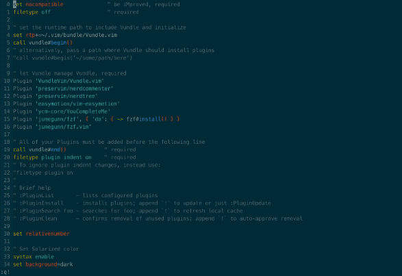

# Roberto's Vim configuration #

## Plugins included ##
* FZF
* Nerd Commenter
* Nerd Tree
* Easy Motion 
* You Complete Me

### Quick install ###
1. Install fuzzy finder (OSX: `brew install fzf`)   
2. Remove vimrc from home directoty `rm .vimrc`    
3. Clone this repo `git clone https://github.com/robertoodogherty/.vim.git`   
4. Create link for vimrc to home directory `ln ~/.vim/vimrc ~/.vimrc`   
5. Clone Vundle into this repo `git clone https://github.com/VundleVim/Vundle.vim.git ~/.vim/bundle/Vundle.vim`   
6. Open vim and run `:PluginInstall`   
7. Follow the YCM installation instructions here https://github.com/ycm-core/YouCompleteMe#installation   

### OSX Users
If you're on OSX ensure you are using mvim. You can look at how we do this in in the config repo alias.sh file https://github.com/robertoodogherty/config   
